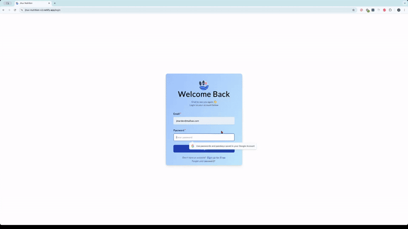

# <a href="https://jhuvnutrition.fit"> Jhuv Nutrition </a>

Welcome to Jhuv Nutrition, a full-stack e-commerce platform built with the MERN Stack (MongoDB, Express, React, Node.js) and powered entirely by TypeScript. The backend handles product data, user authentication, and order management, while MongoDB stores critical application data. On the frontend, React and TypeScript work together to create a dynamic and reliable user interface, offering a seamless and interactive shopping experience.

### Demo

<div align="center">
  
</div>

**Things to do:**
- Navigate around the SPA
- Create an account or log in.
- Forget password and you get an email sent to you 📫
- Update password in account page
- Add items in cart.
- Check items in cart page
- Add address and discount code
- Checkout with Stripe payment integration
- Logout

<!-- > [!WARNING]  
> Safari ITP and mobile security restrictions are causing issues for the cookies needed to Login/SignUp and interact with the cart (Currently working on a fix). Therefore, please use Chrome/Brave/Firefox/Edge/Opera on Desktop/Laptop to test the Authentication and Authorization. -->


---

## Project Overview

Jhuv Nutrition is a full-stack e-commerce application built with the MERN Stack (MongoDB, Express, React, Node.js) and styled using Tailwind CSS for a modern, responsive design. The backend is powered by Node.js and Express, providing a RESTful API to manage product data, user authentication, and orders. MongoDB serves as the database, storing product information, user profiles, and transaction history. On the frontend, React handles the user interface, enabling dynamic product browsing, secure login, and a smooth checkout process, while React Router ensures seamless navigation throughout the site.

Key features of the application include user authentication with JWT tokens, the ability to add products to a shopping cart, and an integrated payment system. Tailwind CSS is used for utility-first styling, ensuring the app is both visually appealing and responsive across devices. This project demonstrates the full scope of MERN stack development, from API integration to frontend design, providing a solid foundation for a modern, scalable e-commerce platform.

---

## Technologies
- 
- 
- 
- 
- 
- 
- 
- 
- 
- 

## Features

- Interactive UI components
- State management with Context API
- Responsive design
- Dynamic routing
- API integration
- Optimized for performance

---

## Getting Started

### Prerequisites

- **Node.js**: Make sure you have Node.js installed. [Download Node.js](https://nodejs.org/)
- **Git**: Ensure Git is installed to clone the repository.

### Installation

1. Clone the repository:
   ```bash
   git clone https://github.com/yourusername/yourproject.git
   ```
2. Navigate to the project directory:
   ```bash
   cd frontend
   cd backend
   ```
3. Install dependencies:
   ```bash
   npm install
   ```

### Running the Development Server

Run the following command to start the development server for the frontend:

```bash
cd frontend/
npm run dev
```

Your app will be available at `http://localhost:5173` by default.

Run the following command to start the development server for the backend:

```bash
cd backend/
npm run start:dev
```

Your app will be available at `http://localhost:3000` by default.

---


## Project Structure

```plaintext
/
├── frontend/            # All frontend code
├── backend/             # All backend code
```

---

## Contributing

1. Fork the repository.
2. Create a new branch with a descriptive name.
3. Make your changes and commit them.
4. Push your changes to the branch.
5. Open a Pull Request.

---

## Resources

- [Undraw](https://undraw.co/)
- [SVG Repo](https://svgrepo.com/)
- [Unsplash](https://unsplash.com/)
- [Pixabay](https://pixabay.com/)
- [Pexels](https://www.pexels.com/)
- [Figma](https://www.figma.com/)
- [Dribbble](https://dribbble.com/)
- [Google Gemini](https://gemini.google.com/) 

> [!NOTE]  
> Supplement bottle images are generated by Google Gemini and edited with GIMP

---

## License

This project is licensed under the MIT License - see the [LICENSE](LICENSE) file for details.
